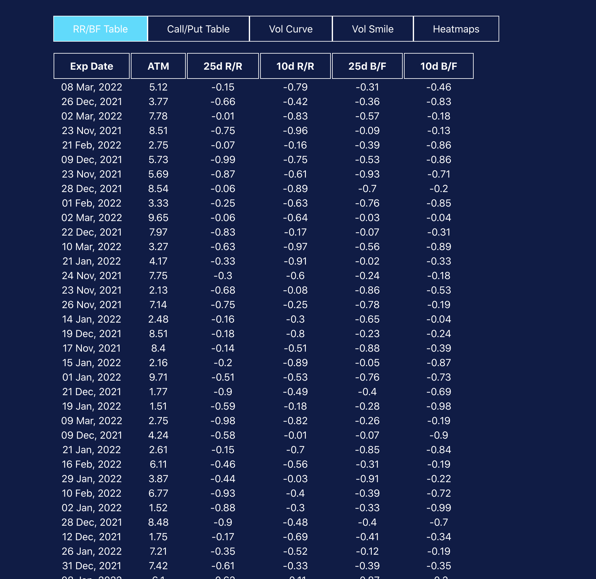
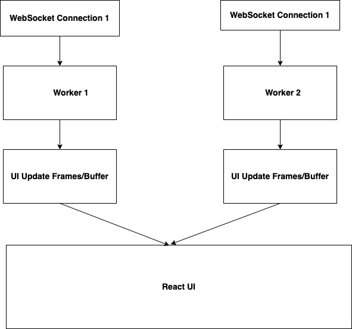

## Introduction

Usually to keep the UI responsive, the computation on UI thread should be done to a mimimal. Any long running task if handled in the UI would result in Jank or unresponsivness UI. Lets consider the below scenerio, where the App receives streaming data from two seperate WebScoket connection at a very fast rate. How do I ensure to keep the UI responsive beside being able to handle all these data and use the data to also derive the UI.

In the above screenshot UI would make two websocket connection with backend (first websocket connection to fetch data for RR/BF table tab and second websocket connection to fetch data for Call/Put table).
When user clicks on RR/BF table, ui would fetch data from backend at 1000 packets/second and it would be displayed over RR/BF Table tab. Backend will continue to stream the data to ui at same rate even after user has switched to another tab. When user clicks on Call/Put table, ui would fetch data from backend at 1000 packets/second and it should be displayed over Call/Put Table. Backend should stream the
data to ui at same rate even after user switched to another tab.

Template/UI for Call/Put Table will be same as RR/BF Table (only data will be different)

All other tabs can remain empty.

## Design Decisions

Since the requirement is to make two Websocket conectionn with high update frequency, a direct update on the UI will result in jank or unresponnsiveness. If we do all the things inluding Websocket connection, and updating of state and rendering of UI in browser UI thread, this would result in Jank.

To counter this, the UI thread needs to be offloaded, all the communication with WebSocket needs to be done in a seperate thread.
I have used WebWorker to offload the WebSocket connection.

The current implementation simulates connecting to an WebSocket and generating a message every 1 ms, collating the messages in a frame/buffer, and updating the UI. When the update would happen in UI, is controlled by constant SEND_UPDATE_ON_NTH_TIME, currently this is set to 100, where if we increase the value to higher value n, it would mean the UI would only get updated only on nth message receiving, but no intermediary message would get lost as they would be collected in buffer, this is also one more cofiguration which could help in fine tuning the performance.

The Worker would continuously buffer the data from stream, even if the RRBF or Call/Put UI component is unmounted, and when they mount back the most recent 40 rows would be displayed. This again is controlled by const MAX_FRAME_SIZE in worker file. As 1ms is a small time for user to be able to discern, so a pragmatic approach would be to only keep the most recent MAX_FRAME_SIZE rows in memory. Also a. high message rate of WebSocket implies streaming of rows, any stream implies use of buffer implicitly, MAX_FRAME_SIZE in this case would be the size of buffer.

Doing this above approach, the UI remains responsive

## Dependenciies

For loading and working with WebWorkers: https://github.com/zonayedpca/react-web-workers

## Available Scripts

In the project directory, you can run:

## `yarn` or `yarn install`

Installs the dependencies
### `yarn start`

Runs the app in the development mode.\
Open [http://localhost:3000](http://localhost:3000) to view it in your browser.

The page will reload when you make changes.\
You may also see any lint errors in the console.

## Final Results

